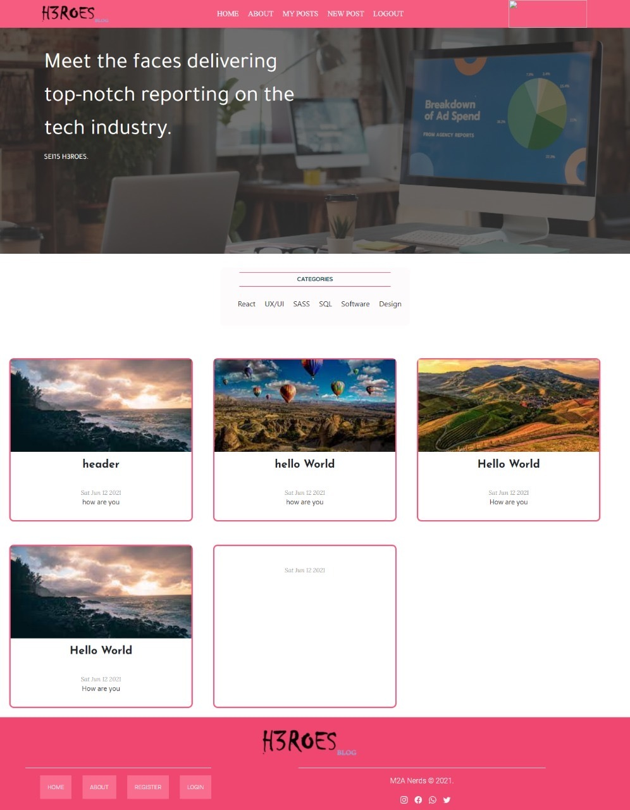
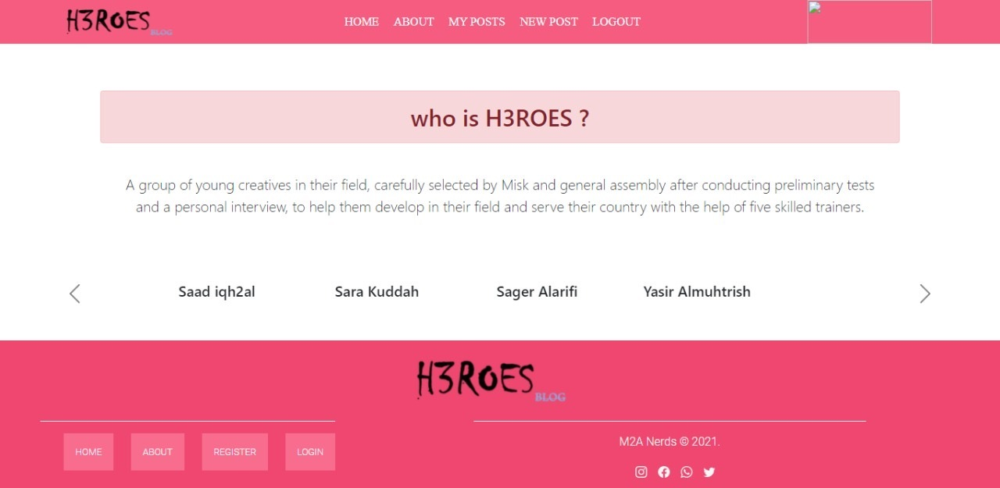
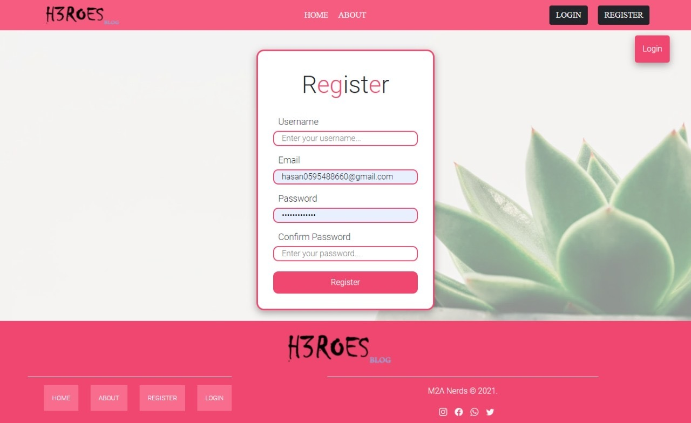
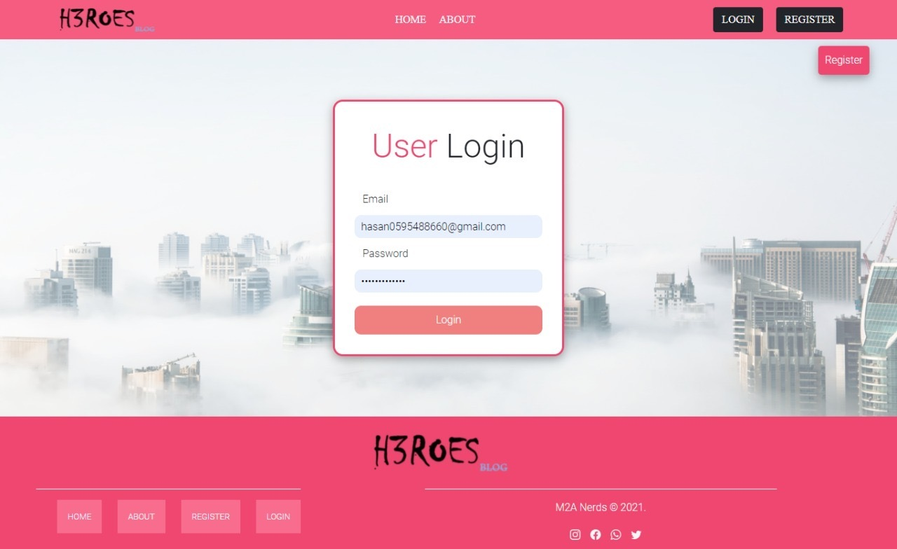
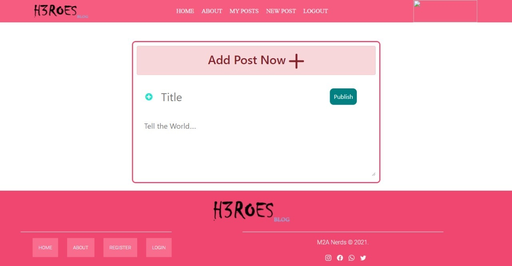
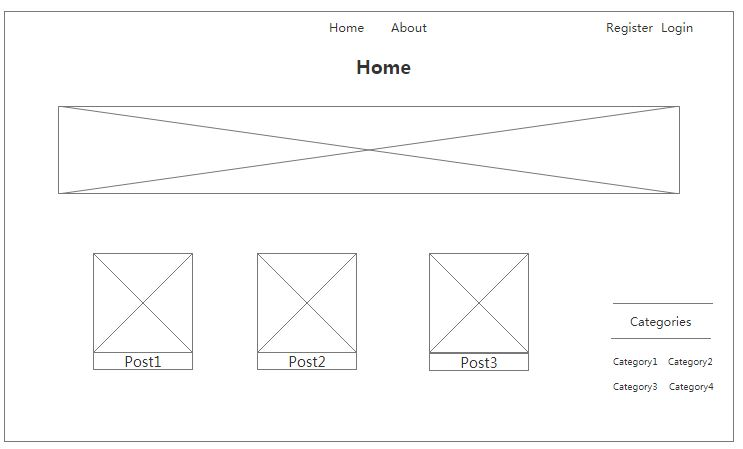
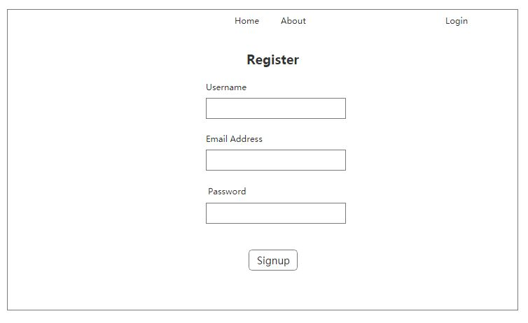
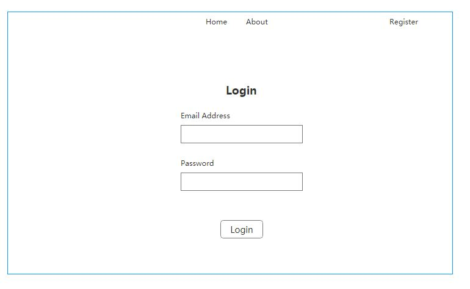
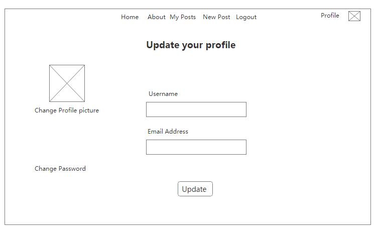
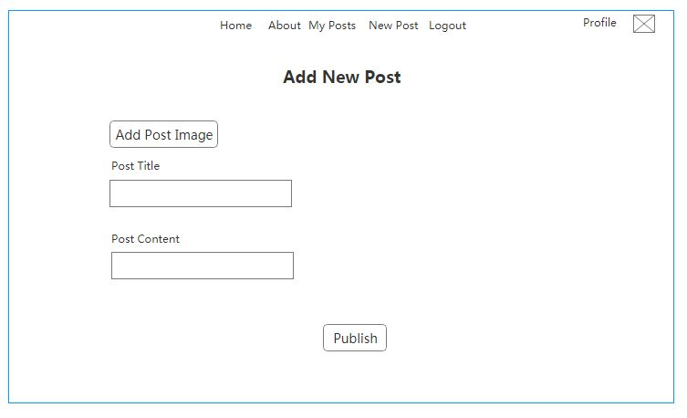

# Description (H3ROES Blog App)

It's simply a Blog application that gathers SEI15 students and allows us to share knowledge, experience and interests in different fields.[Join Us!]()

**Team Members**
* Ahoud kensara
* Mona alsaiqal
* Mona aldawsari

### Important Links:
- [Backend repo](https://git.generalassemb.ly/alsaiqal/Blog-app-Backend)
- [Deployed API]() 
- [Deployed Client]()

### Planning Story:

### User Stories:

1. As a user, I want to be able to sign up with my Email address. so I can create a new post.
2. As a user, I want to Login to explore the posts of my friends and Logout after I am done.
3. As a user, I want to create a new post and add a picture to the post.
4. As a user, I want to see my posts, edit or delete them.
5. As a user, I want to edit my accoun info and change my profile picture.

### Technologies used and packeges: 
+ Reactjs 
+ VS code
+ HTML/Css
+ Context
+ npm i axios
+ npm install --save react-spinners
+ npm i react-router-dom

### List of unsolved problems which would be fixed in future iterations:
+ User can add new category.
+ User can interact with footer
+ User can reset password

## Images
### App Screenchots:
* page 1 : show a screenshot for Home page.

* page 2 : show a screenshot for About page.

* page 3 : show a screenshot for Register page.

* page 4 : show a screenshot for Login page.

* page 5 : show a screenshot for Add post page.

* page 6 : show a screenshot for Update profile page.

### Wireframes:
* page 1 : show a wireframe for Home page.

* page 2 : show a wireframe for Register page.

* page 3 : show a wireframe for Login page.

* page 4 : show a wireframe for Update profile page.

* page 5 : show a wireframe for New Post page.

### Installation instructions:
1. Fork and clone the repo
2. cd my-app
3. npm install
4. npm start
